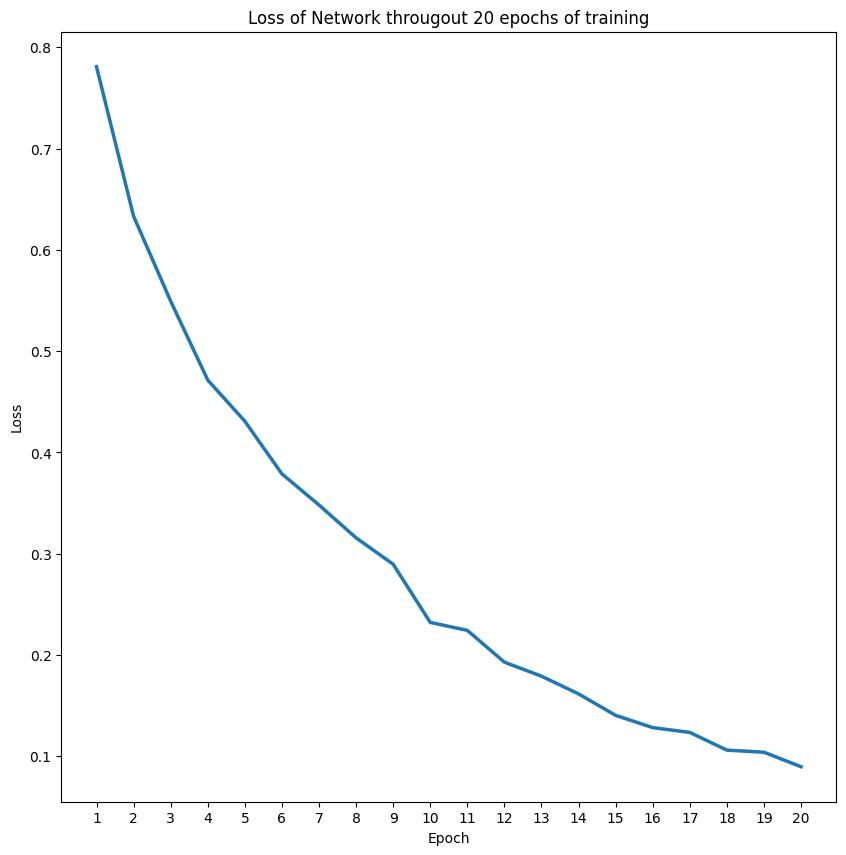

# Convolutional Neural Network using Pytorch #
We implemented a simple Convolutional Neural Network for the task of classifying images of cats and dogs. The dataset consists of 25,000 images and was split in to the train set of 20,000 and the test set of 5,000 images.

The implementation of the Convolutional Neural Network was achieved by using the PyTorch library.

As you read this notebook, you can find details about the loading and preprocessing of the data, the model and its training and testing. 

## Model ##

The Convolutional Neural Network model is implemented in the **`ConvNeuralNetwork`** class. 

This model features 4 convolutional layers, that preceed a maxpool layer, before two final linear (fully connected) layers. The output of the convolutional and the first fully connected layer is passed through a $\text{ReLU}$ activation function.

We used the CrossEntropy loss as a loss function and Stochastic Gradient Descent as an optimizer.

### <u>Cross Entropy</u>
We used the Cross Entropy Loss Function, because it is a very well tested choice for multi-class classification tasks. 

This is because this function measures the un-similarity between the expected probability distribution (of classes) with the true distribution. That is, this function penalizes the model that makes incorrect predictions and encourages the model to extract high probabilities for the correct class.

The Cross Entropy loss function is defined as: $$ L_{CE} = -\frac{1}{N} \sum_{i=1}^{N}{\sum_{j=1}^{C}{y_{ij}\log(\hat{y_{ij}})}}$$

where $N$ is the number of data samples (images in our case) and $C$ is the number of classes. $y_{ij}$ is the true probability of class $j$ for sample $i$ and $\hat{y_{ij}}$ is the predicted probability of class $j$ for sample $i$.

### <u>Stochastic Gradient Descent</u>
We used SGD for the optimizer of our model, since it is an optimization algorithm that is widely used in Deep Learning. 

Stochastic Gradient Descent is updating the parameters (synaptic weights) in the oposite direction of the gradient of the loss function, with respect to the parameters, with the aim to minimize the loss. 

    <figure>
        
    </figure>

## Training ##

The training of the network was done for 20 epochs. In each epoch, we are loading the batches of the data from the trainloader and using the pytorch model that was implemented above, we are passing the elements (images) through the network `outputs = network(inputs)`, while afterwards we are calculating the loss and updating the parameters using back-propagation `loss=criterion(outputs, labels)`, `loss.backwards()`.

    <figure>
        
    </figure>

## Testing ##

Testing was made in a set of 5,000 images, where each image is given as input to the network and the inference of the network is compared to the actual class of the image. If the network's inference was correct, we increment the correct counter. 

In the end, the factor of the `correct` counter over the `total` counter will give us the accuracy of the model. 

The accuracy of our model in this example was 90%.